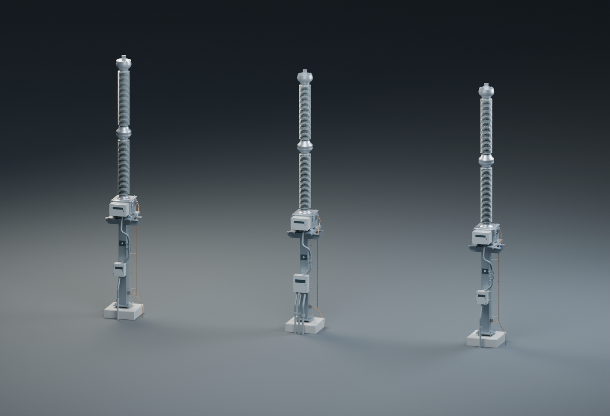
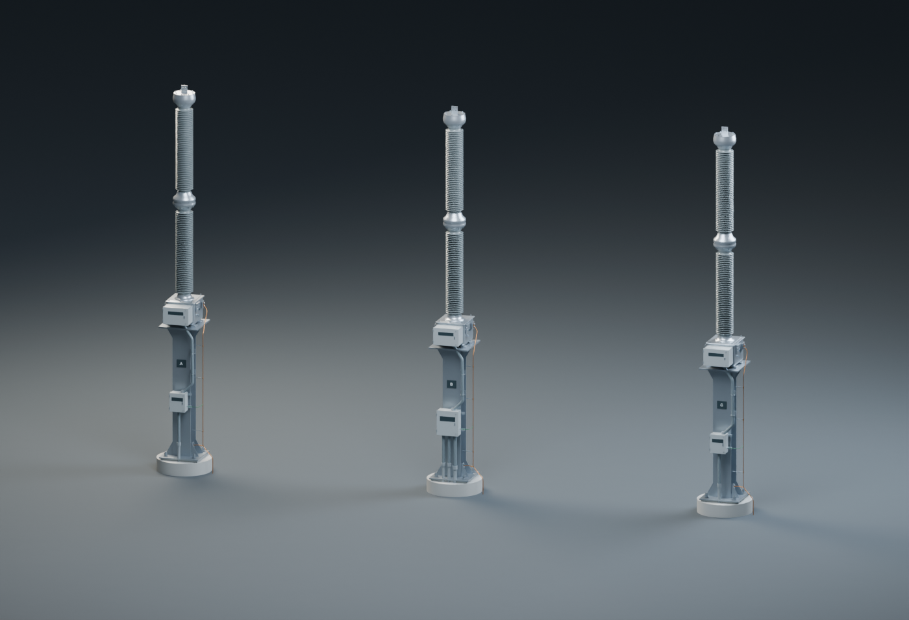

# Capacitive voltage transformer models

Editable Blender assets for visualization.

## Cvt Square Stand



[Open the Blender model](models/cvt-square-stand.blend).

## Cvt Wide Flange Stand



[Open the Blender model](models/cvt-wide-flange-stand.blend).

## Use

Open a file from `models/` in Blender 5.2.1 or a compatible newer version. Units and object transforms are retained in the native scene. `assets.json` lists the available assets and inspection poses. Select a scene to switch prepared views. Labels are outlined geometry and can be edited as meshes.

## Repeatable exports and previews

The editable native model is the build input. This workflow recreates exchange files and previews from that model; it is not a dimensional generator. Change geometry in a working copy of the native model, then run:

```sh
blender --background --python tools/build.py -- --render
```

Outputs go to `build/exports/` and `build/renders/`. To select an asset, add `--asset=NAME`; to choose image width, add `--width=1800`. Blender must be installed and available as `blender` in the terminal. Equipment GLBs are static pose snapshots; animation remains in the native file. Drawing assets remain native scenes with PNG previews.

## Limits

Visualization only. Dimensions, clearances, device ratings, structural adequacy and operating logic are not approved for fabrication, installation, or switching. Do not infer electrical capability from model scale.
